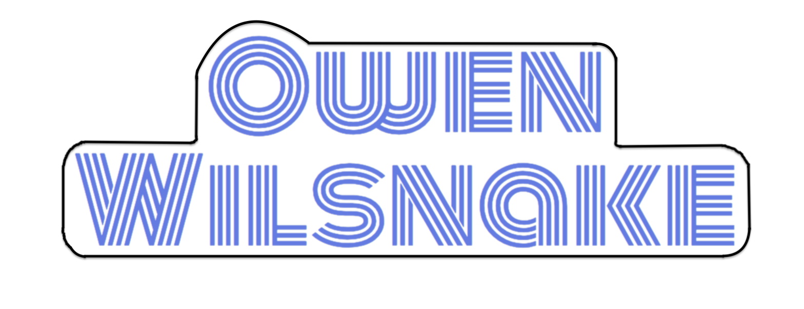

   
   
   <i>Wowww!</i>

## Summary

Owen Wilsnake is a rendition of the classic game, *Snake*, with a fun twist!

## Deployed app

https://goodtimes-client.herokuapp.com/

Server side repo: https://github.com/thinkful-ei22/its_a_date_server

## Features

Users can register to create an account where all their events are stored...

...and login anytime.

Users click create event to start planning and are walked through a series of event options, including a location, time, food and activities.

After selecting the options for the event, Goodtimes auto-generates a form that can be publically accessed.
You can email your friends directly from the Goodtimes website and send them a bitly link that will take them to the voting form.

Users' friends can vote on the times and places that work best for them...

...and users can check the results of the votes on their dashboard.

When everyone has voted, users can let their group know which options came out on top!

## Tech-Stack

Front-end                       | Back-end
--------------------------------|------------------------------------
 HTML                           |  Node/Express
 CSS                            |  Sendgrid
 React                          |  MongoDB/mongoose
 Redux                          |  JSON Webtoken
 React-Router                   |  Bcrypt.js
 Redux-Form                     |  Passport.js
 React-Icons                    |  Axios
 Moment.js                      |  Request/Promise
 Node-sass                      |  Bit.ly API
 Bing Maps API                  |  Yelp API
 Enzyme/jest                    |  Event Bright API
 Continuous Integration (Travis)|  Mocha/Chai
 Continuous Deployment (Heroku) |  Continuous Integration (Travis)
 .                              |  Continuous Deployment (Heroku)

## Team Members

Jennifer Colna

Morgan Huegel

Chasen Arey

William Holcombe

Donny Cheng
